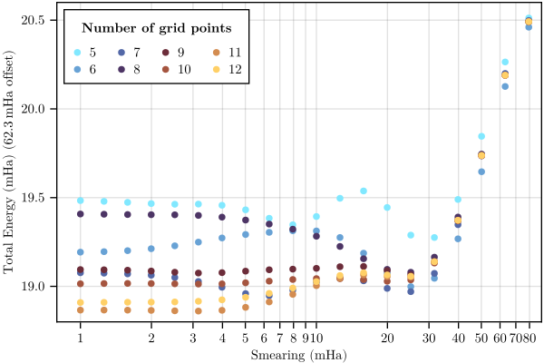

# DFT calculation

## Convergenge w.r.t. cutoff energy

```bash
mpirun -n 4 abinit conv-Ecut.abi 1> out-Ecut.log 2> err.log
```


Fitting an exponential we get:

$$ y = \exp(12.23956 - 0.5668441x) - 62.28018 \quad [\mathrm{Ha}] $$

Taking $E_{cut} = 42\ \textrm{Ha}$, we get an error of ca. $9.4\ \mathrm{\mu Ha}$

## Convergence w.r.t. $k$-points and $t_{smear}$

```bash
mpirun -n 4 abinit conv-kpt-smear.abi 1> out-kt.log 2> err.log
```


From plot, best option with reasonable amount of $k$-points is:
```bash
ngkpt 7 7 7
tsmear 0.006 # 6mHa
```

## Relaxation

Perform BFGS structural relaxation to optimize ion position and cell shape/size. We get:
```
acell    5.4192779505E+00  5.4192779505E+00  5.4192779505E+00 Bohr
rprim   -5.7735026919E-01  5.7735026919E-01  5.7735026919E-01
         5.7735026919E-01 -5.7735026919E-01  5.7735026919E-01
         5.7735026919E-01  5.7735026919E-01 -5.7735026919E-01
```

which is equivalent to a lattice constant of:

$$ a = \frac{0.57735026919}{0.5} \times 5.4192025335\ \mathrm{Bohr}  = 0.3311373528013957\ \mathrm{nm}  $$

which differs only slightly from the empirical value of $0.33004\ \mathrm{nm}$

## Electronic properties
```bash
mpirun -n 4 abinit electronic.abi 1> electronic.log 2> err.log
```
The relevant outputs are:
- Bands in `out/electronic_DS2_EBANDS.dat`
- Density of states in `out/electronic_DS3_DOS`
- Fermi surface in `out/electronic_DS3_BXSF`

