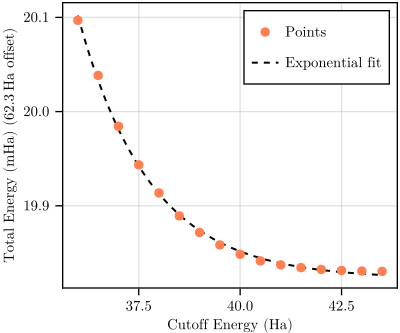
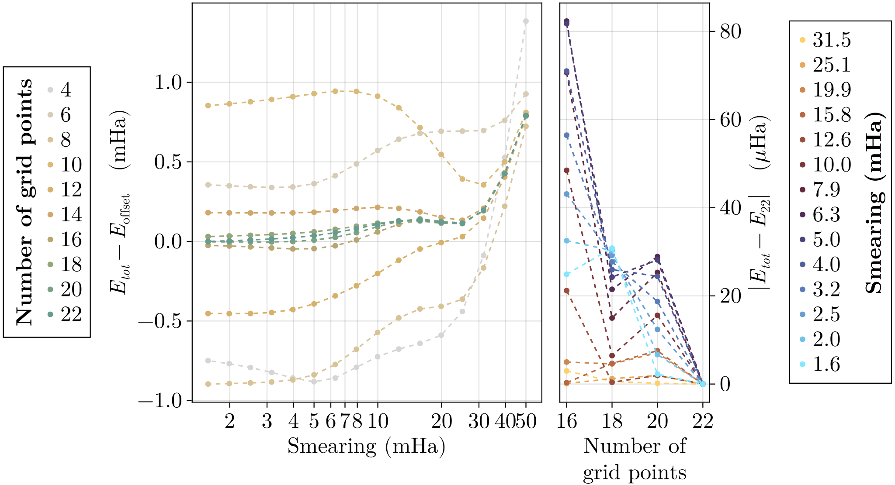
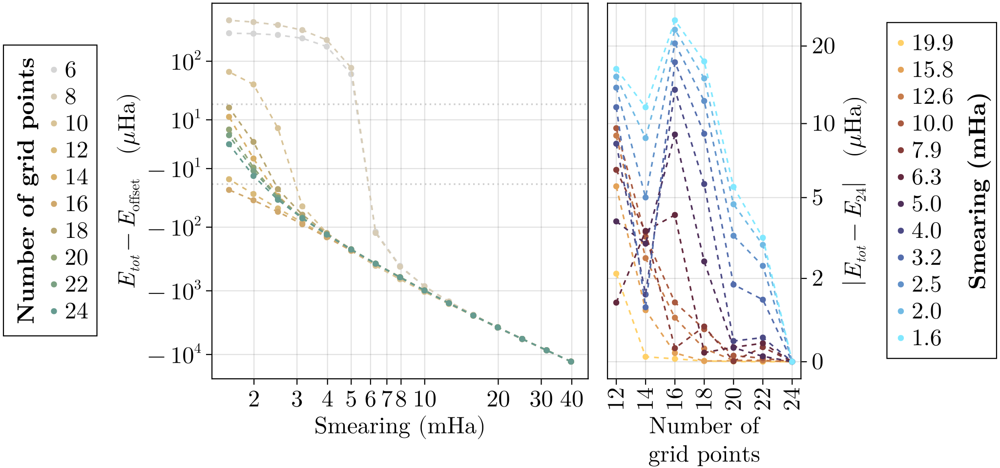
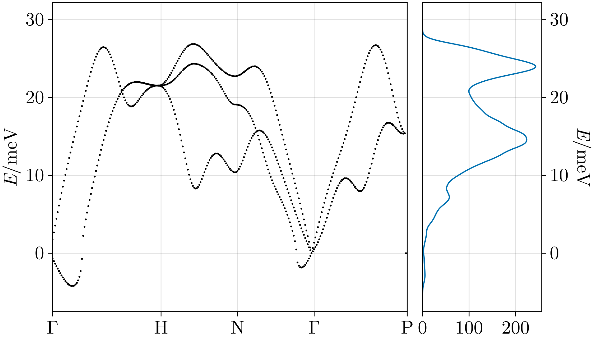

# DFT calculation

## Convergenge w.r.t. cutoff energy

```bash
# On tmux or equivalent
mpirun -n 4 abinit ecut.abi 1> ecut.log 2> err.log

# See progress
tail -n +1 -f ecut.log | grep -E "== DATASET|ecut\(hartree\)|wall_time|toldfe|Etot"

# Once finished, get values
cat ecut.log | grep "etotal"

# Remove all files to save disk space
rm ./out/ecut_*
```



Fitting an exponential we get:

$$ y = \exp(12.23956 - 0.5668441x) - 62.28018 \quad [\mathrm{Ha}] $$

Taking $E_{cut} = 42\ \textrm{Ha}$, we get an error of ca. $9.4\ \mathrm{\mu Ha}$

## Convergenece w.r.t. $k$-grid and $T_{smear}$

> NOTE: To speedup computation, each dataset (in total 176) uses the results of the previous one as a first guess. However, this tecnique requires a large available disk space c.a. 40GB

We investigated two options for the smearing function: cold and gaussian smearing, which is chosen with the abinit variable `occopt` (value 4 and 7 respectively).

```bash
# On tmux or equivalent
mpirun -n abinit conv-kpt-smear.abi 1> kpt-tsmear.log 2> err.log

# See progress
tail -n +1 -f kpt-tsmear.log | grep -E "== DATASET|wall_time|toldfe|Etot"

# Once finished, get values
cat ecut.log | grep "etotal"

# Remove all files to save disk space
rm ./out/kpt-smear_*
```

### Cold smearing


### Gaussian smearing


### Final choice

We opt for cold smearing as this option allows us to choose a bigger $T_{smear}$ while keeping the total energy not too far from the "true" one. In particular we chose: 
- $T_{smear} = 9\ \mathrm{mHa}$
- $18\times 18 \times 18\ k$-grid

This choice implies:
- Distance from of $E_{tot}$ from "true value" around $0.1\ \mathrm{mHa}$
- Distance from the completely converged $E_{tot}$ vs $T_{smear}$ curve around $30 \ \mathrm{\mu Ha}$ 

Moreover, it will allows us to set the $q$-grid equal to $6 \times 6\times 6$ which is a reaonably small subgrid of the $k$-grid.

## Relaxation

```bash
# Lauch relaxation on tmux or equivalent
mpirun -n 4 abinit relax.abi 1> relax.log 2> err.log

# See progress
tail -n +1 -f relax.log | grep -E "Iteration|wall_time"

# Get final lattice constant
cat relax.log | grep "acell"
```

We perform BFGS structural relaxation to optimize cell size. We get the relaxed lattice constant of $6.2600834178\ \mathrm{Bohr} = 331.271094\ \mathrm{pm}$ which differs only slightly from the empirical value of $330.04\ \mathrm{pm}$

To accelerate the ground state calculation of followinf scripts, we save the resulting wavefunction and density to a `save` folder. 
```bash
mkdir save
mv out/relax_WFK save/b16_dfe8_WFK
mv out/relax_TIM4_DEN save/b16_dfe8_DEN # assuming forth relaxation step is the last
rm out/relax_* # save disk space
```

## Electronic properties
```bash
mpirun -n 4 abinit electronic.abi 1> electronic.log 2> err.log
```
The relevant outputs are:
- Bands in `out/electronic_DS2_EBANDS.data`
- Density of states in `out/electronic_DS3_DOS`
- Fermi surface in `out/electronic_DS3_BXSF`


## Phonon properties

```bash
# Inside tmux or equivalent, compute derivative database
mpirun -n 4 abinit ddb.abi 1> ddb.log 2> err.log

# To follow iterations on other terminal
tail -f ddb.log | grep -E "== DATASET|ITER STEP|Perturbation"

# Once finished, merge all the databases together
mrgddb < merge-ddb.txt

# Finally, compute phononic bands and DOS
anaddb phononic.abi
```
The relevant outputs are:
- Bands in `out/phononic_PHBANDS.data`
- Density of states in `out/phononic_PHDOS`

